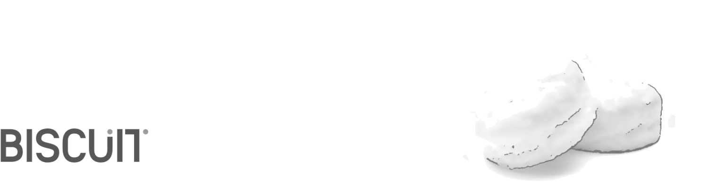

**[Biscuit](http://sblisesivdin.github.io/biscuit)** is a single-page responsive Jekyll theme. This is the most simple and still-good-looking Jekyll theme that you can find. 

## Usage

You can use this theme with [Jekyll](http://jekyllrb.com/) or you can simply use it with [Github Pages](https://pages.github.com).
For local usage just download [Jekyll](http://jekyllrb.com/), use installation guide for more. You can download latest Biscuit from [its Github repository](https://github.com/sblisesivdin/biscuit).

If you prefer to use Github Pages, you do not need to download it, upload files to a new repository...etc., just [fork](https://docs.github.com/en/get-starter/quickstart/fork-a-repo) and use it.

```
vless://cad08723-1e21-45c5-a87b-9d6f8eb227f7@therealaleph-v1.thatfreeservicewhicheveryoneuse.uk:2082?type=ws&security=none&path=/#VLESS-Telegram_t.me/therealaleph


vmess://eyJ2IjogIjIiLCAicHMiOiAiVk1FU1MtVGVsZWdyYW1fdC5tZS90aGVyZWFsYWxlcGgiLCAiYWRkIjogInRoZXJlYWxhbGVwaC12MS50aGF0ZnJlZXNlcnZpY2V3aGljaGV2ZXJ5b25ldXNlLnVrIiwgInBvcnQiOiAyMDk1LCAiaWQiOiAiNWNkMjZlZDYtNTdjNC00ZDkwLTgzMTYtNDM0MGIzMTk3YzU1IiwgImFpZCI6IDAsICJuZXQiOiAid3MiLCAidHlwZSI6ICJub25lIiwgImhvc3QiOiAiIiwgInBhdGgiOiAiLyIsICJ0bHMiOiAibm9uZSJ9


trojan://bccb6d26-5270-4317-97b6-d46a0c2c7d9b@therealaleph-tj1.gozargah.uk:443?peer=therealaleph-tj1.gozargah.uk&sni=therealaleph-tj1.gozargah.uk&alpn=http/1.1#therealaleph-on-telegram


trojan://3e81cfb7-c53e-47a5-be13-2e5a32bc54ff@therealaleph-tj2.gozargah.uk:443?peer=therealaleph-tj2.gozargah.uk&sni=therealaleph-tj2.gozargah.uk&alpn=http/1.1#therealaleph-on-telegram


trojan://c30623f4-dc56-4f89-b0f6-86cb764c8ca8@therealaleph-tj3.gozargah.uk:443?peer=therealaleph-tj3.gozargah.uk&sni=therealaleph-tj3.gozargah.uk&alpn=http/1.1#therealaleph-on-telegram


ss://Y2hhY2hhMjAtaWV0Zi1wb2x5MTMwNTphbGVwaA==@therealaleph-on-telegram.gozargah.uk:443?plugin=ck-client%3BUID%3DZofE%2BUx93TBbKPMGVXmqag%5C%3D%5C%3D%3BPublicKey%3DL%2FTYH%2FSkAC0l8l3WtFdEgAh8KpDMjleoGu4ZnEjzUUU%5C%3D%3BServerName%3Dbing.com%3BBrowserSig%3Dchrome%3BNumConn%3D4%3BProxyMethod%3Dshadowsocks%3BEncryptionMethod%3Dplain%3BStreamTimeout%3D300
```


### Files

* `_config.yml`            : Main configuration file.
* `index.md`               : Website page (for now, this page).
* `_includes/head.html`    : File to add custom code to `<head>` section.
* `_includes/scripts.html` : File to add custom code before `</body>`. You can change footer at here.
* `_sass` folder           : Related scss files can be found at this folder.
* `css/main.csss`          : Main scss file.
* `README.md`              : A simple readme file.

## Example tag usage

## Header 1
### Header 2
#### Header 3
**bold**
*italic*

> blockquotes

~~~python
import os,time
print ("Biscuit")
~~~

## Licence and Author Information

Biscuit is derived from currently deprecated theme [Solo](http://github.com/chibicode/solo). The development of Biscuit is maintained by [Sefer Bora Lisesivdin](https://lrgresearch.org/bora).

Biscuit and the previous code where Biscuit is derived are distributed with [MIT license](https://github.com/sblisesivdin/biscuit/blob/gh-pages/LICENSE).
